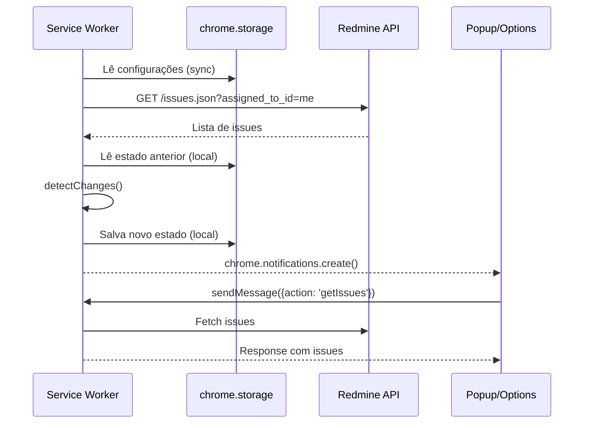

# 📋 Redmine Notificações — Documentação Técnica

## Visão Geral

Extensão Chrome/Edge (Manifest V3) que monitora demandas do Redmine via API REST, envia notificações de desktop e oferece um painel popup para consulta rápida de issues.

---

## Arquitetura

```
redmine-notifier/
├── manifest.json              # Manifest V3 — permissões, scripts, ícones
├── background/
│   └── service-worker.js      # Service Worker — polling, detecção de mudanças, notificações
├── popup/
│   ├── popup.html             # Interface do popup (abas, filtros, lista)
│   ├── popup.css              # Estilos do popup
│   └── popup.js               # Lógica de UI: renderização, filtros, paginação
├── options/
│   ├── options.html           # Página de configurações
│   ├── options.css            # Estilos das configurações
│   └── options.js             # Formulário, teste de conexão, persistência
├── icons/
│   └── generate-icons.html    # Utilitário para gerar ícones PNG
└── README.md                  # Instruções de instalação e uso
```

### Fluxo de Dados



---

## Componentes

### 1. Service Worker (`background/service-worker.js`)

| Função | Responsabilidade |
|--------|-----------------|
| `checkRedmine()` | Loop principal: busca issues, detecta mudanças, envia notificações |
| `silentSync()` | Sync inicial sem notificações (define baseline) |
| `fetchAssignedIssues(config)` | GET `/issues.json?assigned_to_id=me&status_id=open` |
| `fetchGeneralIssues(config, query, offset, filters)` | Busca geral com filtros server-side |
| `fetchGeneralStats(config, query, filters)` | 3 requests paralelos para contadores |
| `fetchStatuses(config)` | GET `/issue_statuses.json` |
| `fetchUsers(config)` | Extrai assignees das issues abertas |
| `detectChanges(issues, prevState, config)` | Compara estado: prazos, status, prioridade, comentários |
| `sendNotification(alert, config)` | Cria notificação Chrome |
| `shouldNotify(type, config)` | Gate de segurança — verifica se tipo está habilitado |
| `saveCurrentState(issues, sentAlerts)` | Persiste estado + flags de notificação |
| `getConfig()` | Lê settings de `chrome.storage.sync` |

**Alarme:** `chrome.alarms` com intervalo configurável (padrão 5min).

**Mensageria:** `chrome.runtime.onMessage` responde a ações do popup:
- `getIssues` — Minhas issues
- `getGeneralIssues` — Busca geral com paginação
- `getGeneralStats` — Contadores para aba Geral
- `getStatuses` — Lista de situações
- `getUsers` — Lista de responsáveis
- `checkNow` — Força verificação imediata

### 2. Popup (`popup/`)

**Abas:**
- **Meus RMs** — Issues atribuídas ao usuário, filtros client-side
- **Geral** — Busca global com filtros server-side + paginação

**Funcionalidades:**
- Cards com indicadores visuais de prioridade e prazo
- Filtros: projeto, prioridade, prazo, situação, responsável
- Barra de resumo: total, atrasadas, vence logo, alta prioridade
- Clique no card abre a issue no Redmine

### 3. Options (`options/`)

- Formulário para URL, API Key, intervalo, dias de alerta
- Checkboxes para cada tipo de notificação
- Botão "Testar Conexão" — valida credenciais via `/users/current.json`
- Validação de URL (apenas `http://` ou `https://`)

---

## Armazenamento

| Store | Chave | Conteúdo |
|-------|-------|----------|
| `chrome.storage.sync` | `redmineUrl` | URL base do Redmine |
| `chrome.storage.sync` | `apiKey` | Chave de API do usuário |
| `chrome.storage.sync` | `checkInterval` | Intervalo em minutos (1-60) |
| `chrome.storage.sync` | `deadlineWarningDays` | Dias de antecedência para alerta |
| `chrome.storage.sync` | `notifyDeadlines` | Flag boolean |
| `chrome.storage.sync` | `notifyStatus` | Flag boolean |
| `chrome.storage.sync` | `notifyPriority` | Flag boolean |
| `chrome.storage.sync` | `notifyComments` | Flag boolean |
| `chrome.storage.sync` | `notifyNewAssignment` | Flag boolean |
| `chrome.storage.local` | `issueState` | Estado anterior: `{issueId: {statusId, priorityId, journalCount, dueDate, notifiedOverdue, notifiedDueSoon}}` |

---

## Permissões (manifest.json)

| Permissão | Justificativa |
|-----------|---------------|
| `alarms` | Polling periódico |
| `notifications` | Notificações de desktop |
| `storage` | Persistência de configurações e estado |
| `badges` | Badge vermelho no ícone |
| `https://*/*`, `http://*/*` | Acesso à API Redmine (qualquer domínio) |

---

## Tipos de Notificação

| Tipo | Condição | Repetição |
|------|----------|-----------|
| `deadline_overdue` | `due_date` ≤ hoje | Uma vez (flag `notifiedOverdue`) |
| `deadline_approaching` | `due_date` dentro de N dias | Uma vez (flag `notifiedDueSoon`) |
| `new_assignment` | Issue sem estado anterior | Apenas primeira detecção |
| `status_change` | `status.id` diferente do anterior | A cada mudança |
| `priority_change` | `priority.id` diferente do anterior | A cada mudança |
| `new_comment` | `journals.length` > anterior (com notas) | A cada novo comentário |

---

## Análise de Segurança

### Vulnerabilidades Identificadas e Corrigidas

| # | Severidade | Descrição | Correção Aplicada |
|---|-----------|-----------|-------------------|
| 1 | **Média** | XSS via `innerHTML` — campos `project.name`, `status.name`, `priority.name`, `assigned_to.name` não eram escapados | ✅ Todos os campos agora passam por `escapeHtml()` |
| 2 | **Média** | Parsing frágil de notification ID (`split('-')[2]`) podia falhar com tipos contendo hífens | ✅ Substituído por regex: `/^redmine-[a-z_]+-(\d+)-\d+$/` |
| 3 | **Baixa** | URL aceita esquemas não-HTTP (ex: `javascript:`) | ✅ Validação `^https?://` em save e test |

### Riscos Residuais (aceitos/mitigados)

| # | Severidade | Descrição | Mitigação |
|---|-----------|-----------|-----------|
| 1 | **Média** | `host_permissions` muito amplas (`*://*/*`) | Necessário pois URL Redmine varia por cliente. Alternativa: usar `optional_host_permissions` e solicitar sob demanda |
| 2 | **Baixa** | API Key armazenada em `chrome.storage.sync` (sincroniza via Google) | Risco inerente de extensões Chrome. Alternativa: migrar para `storage.local` (perde sync entre dispositivos) |
| 3 | **Baixa** | HTTP permitido — API Key trafega sem criptografia | Recomendação: sempre usar HTTPS. Extensão não bloqueia HTTP por ser cenário de intranet comum |
| 4 | **Informativo** | Sem rate-limiting no refresh manual | Impacto baixo — rate limit do Redmine protege o servidor |

---

## Análise de Bugs

| # | Status | Descrição |
|---|--------|-----------|
| 1 | ✅ Corrigido | Código morto: `applyGeneralFilters()` nunca chamada — removida |
| 2 | ✅ Corrigido | Código morto: `hasActiveFilters()` nunca chamada — removida |
| 3 | ⚠️ Conhecido | Filtro de prioridade no HTML (`popup.html`) incompleto — falta Urgente (4) e Imediata (5). Funciona parcialmente pois aba "Geral" popula do servidor |
| 4 | ⚠️ Conhecido | `loadIssues()` não previne chamadas concorrentes em cliques rápidos. Impacto: requisições duplicadas, sem efeito funcional |
| 5 | ⚠️ Conhecido | `silentSync()` no `onInstalled` pode falhar silenciosamente se API estiver lenta durante startup — comportamento intencional (catch + log) |

---

## Code Smells Identificados

| # | Tipo | Local | Descrição |
|---|------|-------|-----------|
| 1 | Debug logs | `service-worker.js` | Muitos `console.log` — aceitável para extensão em desenvolvimento |
| 2 | Magic numbers | `service-worker.js` | IDs de prioridade (3, 4, 5) hardcoded — IDs Redmine default |
| 3 | Lógica duplicada | `popup.js` | Filtros client-side vs server-side compartilham padrão mas divergem em implementação — by design |
| 4 | Nomes mistos | Todo o projeto | Mistura PT/EN em variáveis e mensagens — aceitável para projeto interno brasileiro |

---

## API Redmine Consumida

| Endpoint | Método | Uso |
|----------|--------|-----|
| `/issues.json?assigned_to_id=me&status_id=open` | GET | Issues do usuário |
| `/issues.json` (com filtros) | GET | Busca geral |
| `/issues/{id}.json?include=journals` | GET | Detalhe de issue |
| `/issue_statuses.json` | GET | Lista de situações |
| `/users/current.json` | GET | Teste de conexão |

**Autenticação:** Header `X-Redmine-API-Key`.

---

## Requisitos

- Redmine ≥ 3.0 com API REST habilitada
- API Key gerada (Minha conta → Chave de acesso à API)
- Chrome 88+ ou Edge 88+ (suporte a Manifest V3 e Service Workers)

---

## Build & Deploy

Não há build step. A extensão é carregada diretamente como "unpacked extension":

1. Gere ícones via `icons/generate-icons.html`
2. Abra `chrome://extensions/` → Modo Desenvolvedor → Carregar sem compactação
3. Selecione a pasta raiz do projeto

Para distribuição na Chrome Web Store:
```bash
# Zipar para upload
zip -r redmine-notifier.zip . -x ".git/*" "DOCS.md" "*.md"
```

---

## Changelog

### v1.0.0
- Polling com alarme configurável
- Notificações: prazo, status, prioridade, comentários, novas atribuições
- Popup com abas (Meus RMs / Geral)
- Filtros client-side e server-side
- Paginação na aba Geral
- Configurações com teste de conexão
- Badge de urgência no ícone
